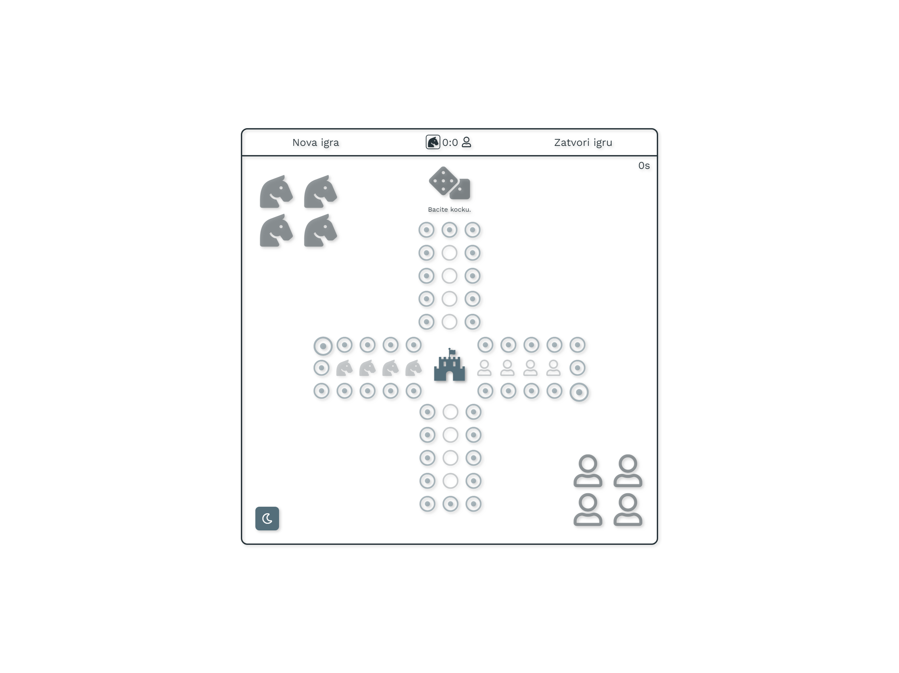
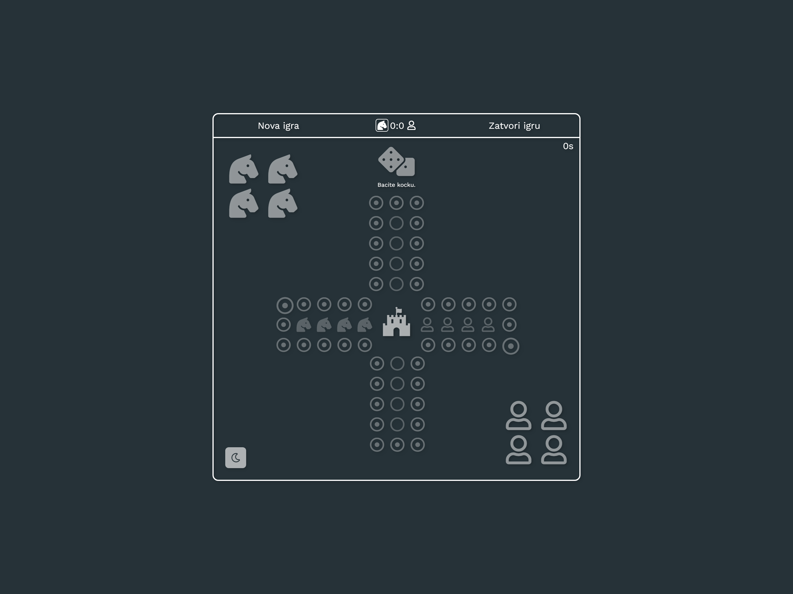

# projekatZaFaks


Ovaj projekat je vezan za moj [privatni respozitorijum](https://github.com/Marko9827/projekatZaFaks). ``` Respozitorijum je postavljen na javno 08/11/2021 u 21:25PM ```

Naziv: Neljuti se čoveče

Licenca: [MIT](https://github.com/Marko9827/projekatZaFaks/blob/main/LICENSE)

Za pokretanje projekta morate imati instaliran nodejs. Pa onda da startujete server.js preko komande ``` node server.js ```. Naravno možete startovati projekat direktnim ulazom na index.html preko web pregledača. 

> Upozorenje ukoliko aplikacija ne radi pravilno morate je startovati preko bilo kog servera!

> Windows build uskoro!

U projektu korišćeno:

- FontAwesome Icons (UI)
- Nodejs
- NPM(Jquery(podrška za UI i kod gde neće 'obični' JS),FontAwesome,express )
- JavaScript 
- Css (UI)
- Css Animacije (UI)

# Pokretanje preko nodjes
 1. Idi na ```root``` folder projekta. Tvoj /folder/```projekatZaFaks```
 2. npm install
 3. npm start
 4. Automatizovana skripta će vas odvesti na željeni link. Malo strpljena!

# Pokretanje preko bilo kog servera
 1. Idi na ```root``` folder servera. Tvoj /folder/```projekatZaFaks```/app
 2. npm install
 3. U Web pregledač kucaj Tvoj link servera/```projekatZaFaks```/app

> Za informacije kako teče(**šta se dešava u pozadini**) igra možete videti u consoli web pregledača

Neke od komandi za consolu: 

| Komanda            | Čemu služi                                                         |
| ------------------ | ------------------------------------------------------------------ |
| igra.testiraj();   | Testira zbog bagova NE aktivirati OVO u toku igre!                 |
| igra.start();      | Nova igra                                                          |
| igra.kocka(A);     | Igrač A baca kocku                                                 |
| igra.kocka(B);     | Igrač B baca kocku                                                 |
| igra.stop();       | Zavšrena igra                                                      |
| igra.cancel();     | Zatvara karticu                                                    |
| igra.pobe('A');    | Pobedio igrač A, varanje                                           |
| igra.tema()        | Promena na tamnu temu ili na svetlu                                |
| igra.pobe('B');    | Pobedio igrač B, varanje                                           |
| igra.log(3);       | Sačuvaj rezlutat igre                                              |
| igra.log(1);       | Pokreći log u consoli                                              |
| igra.log(0);       | Igra i dalje radi ali se ne prikazuje u Consoli od Web pregledača  |

> Status (Vidi se samo na Github, privatni je respozitorijum trebaće vam pristup!)
[](https://github.com/Marko9827/projekatZaFaks/actions/workflows/node.js.yml)

> Moj algoritam po kojem sam radio
[](Ralgoritam.svg)

> Bela tema 
[](app/access/img/tema_bela.png)

> Tamna tema 
[](app/access/img/tema_tamna.png)

# Kontakt informacije:

- Ime i prezime: [Marko Nikolić](https://github.com/Marko9827/)
- Lični email: [marko.supergun@gmail.com](marko.supergun@gmail.com)
- Linkedin profil: [markonikolic98](https://www.linkedin.com/in/markonikolic98/)
- Prijavi bug: Na projektu [ovde](https://github.com/Marko9827/projekatZaFaks/issues).
